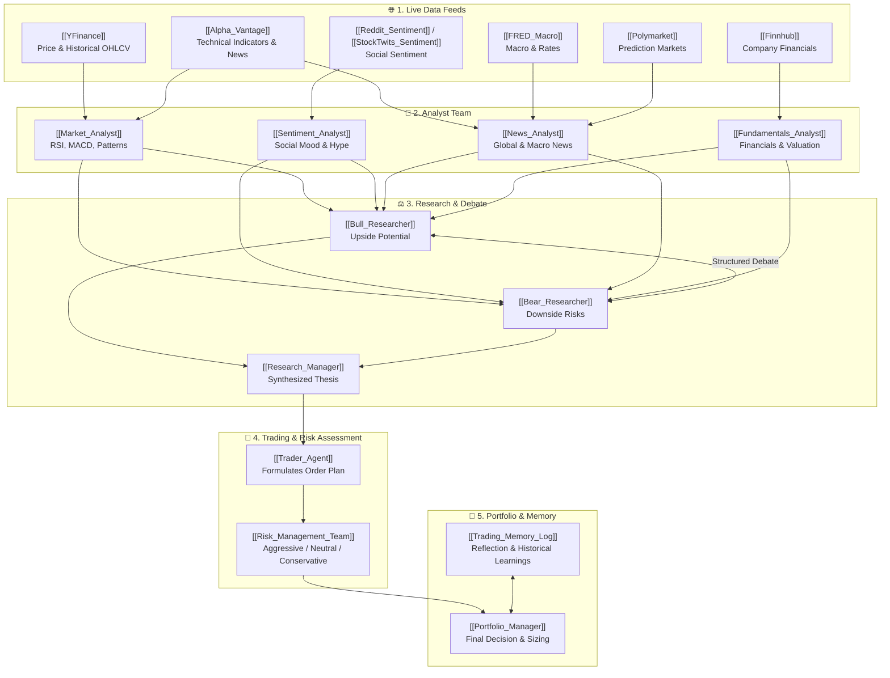

# 🌐 TradingAgents Command Center

> [!abstract] **System Overview**
> **TradingAgents** is a multi-agent LLM financial trading framework that mirrors institutional trading firms. It orchestrates specialized analyst teams, structured bull/bear researcher debates, automated risk committees, and memory-driven portfolio management.

---

## ⚡ Quick Navigation

| 🤖 **Agents & Roles** | 🌐 **Data Sources & Tools** | 📁 **Storage & Architecture** |
| :--- | :--- | :--- |
| • [[Market_Analyst\|📈 Technical Analyst]] • [[Sentiment_Analyst\|💬 Sentiment Analyst]] • [[News_Analyst\|📰 News Analyst]] • [[Fundamentals_Analyst\|🏢 Fundamentals Analyst]] | • [[Alpha_Vantage\|⚡ Alpha Vantage]] • [[YFinance\|📊 YFinance]] • [[Finnhub\|🎯 Finnhub Data]] • [[FRED_Macro\|🏛️ FRED Macro Indicators]] | • [[File_Storage_Map\|🗂️ File & Cache Map]] • [[_Template_Trade_Report\|📑 Trade Report Template]] • [[TradingAgents_Architecture.canvas\|🎨 Visual System Canvas]] • [[Trend_Pullback_Structure_Break_Bot\|🤖 MT5 Bot (M5/M15)]] |
| • [[Bull_Researcher\|🐂 Bull Researcher]] • [[Bear_Researcher\|🐻 Bear Researcher]] • [[Research_Manager\|⚖️ Research Manager]] | • [[Polymarket\|🔮 Polymarket Probabilities]] • [[Reddit_Sentiment\|👾 Reddit Chatter]] • [[StockTwits_Sentiment\|📱 StockTwits Sentiment]] | • `results_dir/reports/` • `data_cache_dir/` • `trading_memory.md` |
| • [[Trader_Agent\|🎯 Trader Agent]] • [[Risk_Management_Team\|🛡️ Risk Management Team]] • [[Portfolio_Manager\|💼 Portfolio Manager]] | • [[Trading_Memory_Log\|🧠 Trading Memory Log]] | |

---

## 🏗️ Interactive System Workflow

---

## 📋 Agent Roster & Responsibility Matrix

> [!tip] Click on any agent name to inspect its prompt structure, tool access, and output files.

| Agent | Category | Primary Resources | Key Output File |
| :--- | :--- | :--- | :--- |
| [[Market_Analyst\|Market Analyst]] | Analyst Team | [[YFinance]], [[Alpha_Vantage]] | `1_analysts/market.md` |
| [[Sentiment_Analyst\|Sentiment Analyst]] | Analyst Team | [[StockTwits_Sentiment]], [[Reddit_Sentiment]] | `1_analysts/sentiment.md` |
| [[News_Analyst\|News Analyst]] | Analyst Team | [[Alpha_Vantage]], [[FRED_Macro]], [[Polymarket]] | `1_analysts/news.md` |
| [[Fundamentals_Analyst\|Fundamentals Analyst]] | Analyst Team | [[Finnhub]], SEC Filings | `1_analysts/fundamentals.md` |
| [[Bull_Researcher\|Bull Researcher]] | Research Team | Analyst Reports | `2_research/bull.md` |
| [[Bear_Researcher\|Bear Researcher]] | Research Team | Analyst Reports | `2_research/bear.md` |
| [[Research_Manager\|Research Manager]] | Research Team | Debate Transcript | `2_research/manager.md` |
| [[Trader_Agent\|Trader Agent]] | Trading Team | Research Synthesis | `3_trading/trader.md` |
| [[Risk_Management_Team\|Risk Management Team]] | Risk Team | Proposed Trades, Volatility | `4_risk/*.md` |
| [[Portfolio_Manager\|Portfolio Manager]] | Executive | [[Trading_Memory_Log]], Risk Reports | `5_portfolio/decision.md` |

---

## 🗂️ Reports & Execution Log
- Check `obsidian/04_Run_Reports/` for all executed run reports formatted with Obsidian tags, callouts, and frontmatter.
- Use [[File_Storage_Map]] to see the precise local paths for all data caches and memory files.
