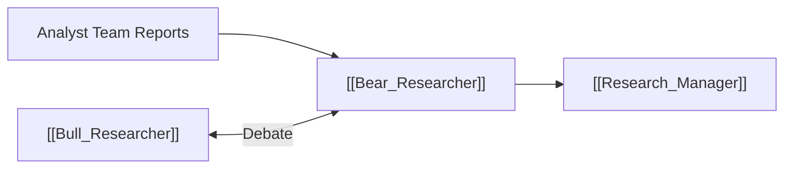

# 🐻 Bear Researcher

> [!info] **Agent Overview**
> The **Bear Researcher** acts as the chief skeptic and devil's advocate. It scrutinizes the bullish narrative, highlights valuation overextension, technical breakdown signals, macroeconomic risks, and potential pitfalls.

---

## 🎯 Role & Objectives
- Identify overbought technical conditions, negative divergence, and overhead resistance.
- Expose valuation risks (excessive multiples, decelerating growth, insider sales).
- Attack overly optimistic forecasts from the [[Bull_Researcher]].
- Formulate downside price risks and worst-case scenarios.

---

## 📁 File Storage & Output Path

- **Source Code**: [`tradingagents/agents/researchers/bear_researcher.py`](file:///Users/ankit/Desktop/new%20lms%20trading/TradingAgents/tradingagents/agents/researchers/bear_researcher.py)
- **Execution Output**: Saved in `2_research/bear.md` (see [[File_Storage_Map]]).
- **Consuming Agents**: [[Bull_Researcher]], [[Research_Manager]]

---

## 🔄 Upstream & Downstream Flow

