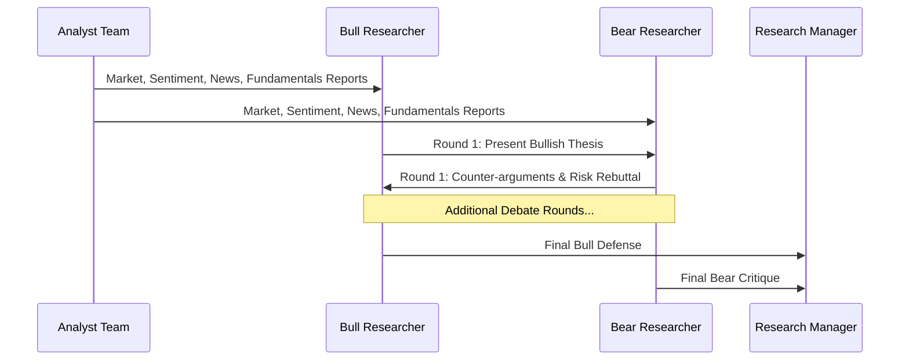

# 🐂 Bull Researcher

> [!info] **Agent Overview**
> The **Bull Researcher** ingests reports from the four analyst disciplines and constructs the most rigorous, data-backed **upside investment thesis**. It actively defends this thesis during multi-round debates against the [[Bear_Researcher]].

---

## 🎯 Role & Objectives
- Synthesize technical breakouts, bullish sentiment, macro tailwinds, and strong fundamentals.
- Formulate concrete price targets, upside catalysts, and margin expansion arguments.
- Defend against skeptical critiques from the [[Bear_Researcher]].
- Prioritize high-probability growth drivers.

---

## 🔄 Structured Debate Flow

The Bull and Bear researchers engage in an interactive debate loop (configured via `max_debate_rounds`):

---

## 📁 File Storage & Output Path

- **Source Code**: [`tradingagents/agents/researchers/bull_researcher.py`](file:///Users/ankit/Desktop/new%20lms%20trading/TradingAgents/tradingagents/agents/researchers/bull_researcher.py)
- **Execution Output**: Saved in `2_research/bull.md` (see [[File_Storage_Map]]).
- **Consuming Agents**: [[Bear_Researcher]], [[Research_Manager]]
