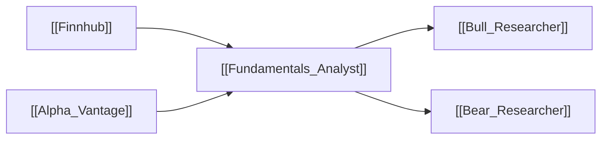

# 🏢 Fundamentals Analyst

> [!info] **Agent Overview**
> The **Fundamentals Analyst** evaluates corporate balance sheets, income statements, cash flow generation, profit margins, debt ratios, and insider transactions to ascertain the company's intrinsic value and fundamental health.

---

## 🎯 Role & Objectives
- Analyze quarterly and annual financial statements (Revenue, Net Income, Free Cash Flow).
- Calculate valuation ratios (P/E, EV/EBITDA, P/S, Debt-to-Equity, ROE).
- Track insider buying/selling activities to detect executive confidence.
- Flag any accounting red flags, debt maturity walls, or deteriorating margins.

---

## 🌐 Consumed Resources & Tools

| Resource | Purpose | Tool Function |
| :--- | :--- | :--- |
| [[Finnhub]] / SEC Filings | Balance sheets, cash flow, income statements, insider trades | `get_fundamentals()`, `get_insider_transactions()` |
| [[Alpha_Vantage]] | Fundamental overview & company financial ratios | `get_fundamentals()` |

---

## 📁 File Storage & Output Path

- **Source Code**: [`tradingagents/agents/analysts/fundamentals_analyst.py`](file:///Users/ankit/Desktop/new%20lms%20trading/TradingAgents/tradingagents/agents/analysts/fundamentals_analyst.py)
- **Execution Output**: Saved inside `1_analysts/fundamentals.md` (see [[File_Storage_Map]]).
- **Consuming Agents**: [[Bull_Researcher]], [[Bear_Researcher]]

---

## 🔄 Upstream & Downstream Flow

