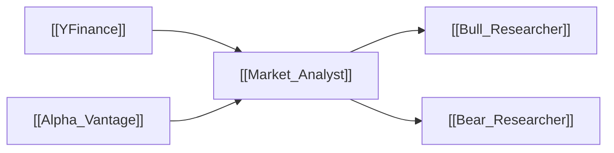

# 📈 Market Analyst (Technical Analyst)

> [!info] **Agent Overview**
> The **Market Analyst** conducts exhaustive technical analysis of price action, chart momentum, volatility, and volume indicators to determine the technical trend and key support/resistance levels.

---

## 🎯 Role & Objectives
- Analyze OHLCV daily and intraday candlestick patterns.
- Calculate moving averages (SMA 20/50/200, EMA 12/26).
- Evaluate momentum indicators including **RSI (Relative Strength Index)** and **MACD (Moving Average Convergence Divergence)**.
- Identify key support, resistance, pivot points, and breakout conditions.

---

## 🌐 Consumed Resources & Tools

| Resource | Purpose | Tool Function |
| :--- | :--- | :--- |
| [[YFinance]] | Historical price candles, volume, moving averages | `get_stock_data()`, `get_indicators()` |
| [[Alpha_Vantage]] | Multi-timeframe technical indicator calculations | `get_indicators()` |

---

## 📁 File Storage & Output Path

- **Source Code**: [`tradingagents/agents/analysts/market_analyst.py`](file:///Users/ankit/Desktop/new%20lms%20trading/TradingAgents/tradingagents/agents/analysts/market_analyst.py)
- **Execution Output**: Saved inside `1_analysts/market.md` in the active run directory (see [[File_Storage_Map]]).
- **Consuming Agents**: [[Bull_Researcher]], [[Bear_Researcher]]

---

## 🔄 Upstream & Downstream Flow

