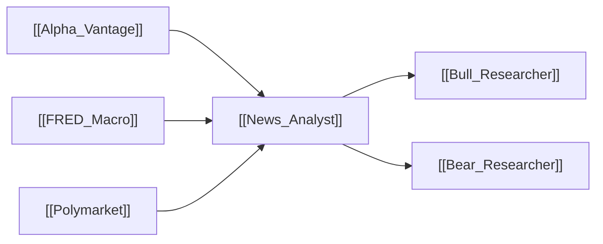

# 📰 News Analyst

> [!info] **Agent Overview**
> The **News Analyst** tracks breaking global headlines, corporate news announcements, macroeconomic indicators (CPI, interest rates, GDP), and prediction market probabilities to assess catalyst events.

---

## 🎯 Role & Objectives
- Fetch company-specific breaking news and analyst upgrades/downgrades.
- Retrieve global macroeconomic context (interest rate environment, inflation trends via **FRED**).
- Consult **Polymarket** prediction market odds on economic and regulatory events.
- Quantify the net positive/negative impact of recent headlines on asset valuation.

---

## 🌐 Consumed Resources & Tools

| Resource | Purpose | Tool Function |
| :--- | :--- | :--- |
| [[Alpha_Vantage]] | Ticker-specific news headlines & sentiment tags | `get_news()` |
| [[FRED_Macro]] | Federal Reserve macro data (Fed Funds rate, CPI, Treasury yields) | `get_macro_indicators()` |
| [[Polymarket]] | Event probabilities & market consensus odds | `get_prediction_markets()` |

---

## 📁 File Storage & Output Path

- **Source Code**: [`tradingagents/agents/analysts/news_analyst.py`](file:///Users/ankit/Desktop/new%20lms%20trading/TradingAgents/tradingagents/agents/analysts/news_analyst.py)
- **Execution Output**: Saved inside `1_analysts/news.md` (see [[File_Storage_Map]]).
- **Consuming Agents**: [[Bull_Researcher]], [[Bear_Researcher]]

---

## 🔄 Upstream & Downstream Flow

