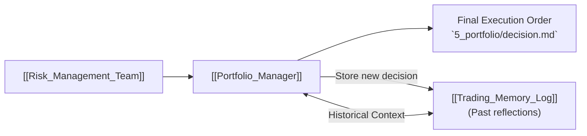

# 💼 Portfolio Manager

> [!info] **Agent Overview**
> The **Portfolio Manager** is the ultimate authority in the TradingAgents system. It reviews the Trader Agent's proposal alongside the Risk Management Team's assessments, consults past reflections from the [[Trading_Memory_Log]], and renders the final binding transaction decision.

---

## 🎯 Role & Objectives
- Approve, reject, or adjust the proposed trade action and sizing.
- Integrate past lessons, mistakes, and historical trading memory for the specific ticker.
- Enforce overarching portfolio risk rules and capital allocation limits.
- Authorize order dispatch to the execution engine.
- Write the final trade verdict to `5_portfolio/decision.md` and persist it to [[Trading_Memory_Log]].

---

## 🔄 Final Decision & Memory Loop

---

## 📁 File Storage & Output Path

- **Source Code**: `tradingagents/agents/managers/portfolio_manager.py`
- **Execution Output**: Saved in `5_portfolio/decision.md` (see [[File_Storage_Map]]).
- **Consolidated Output**: Aggregated into `complete_report.md` and Obsidian run reports in `obsidian/04_Run_Reports/`.
