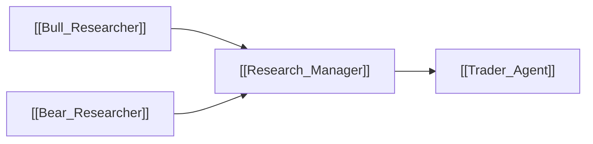

# ⚖️ Research Manager

> [!info] **Agent Overview**
> The **Research Manager** adjudicates the debate between the [[Bull_Researcher]] and the [[Bear_Researcher]]. It weighs the strength of evidence from both sides and issues an unbiased, synthesized **Investment Thesis & Directional Bias**.

---

## 🎯 Role & Objectives
- Act as the objective judge of the bull vs bear debate.
- Resolve conflicting analyst signals (e.g. strong fundamentals vs weakening technicals).
- Determine the overall conviction rating (Bullish, Bearish, or Neutral).
- Produce a structured investment brief that guides the [[Trader_Agent]].

---

## 📁 File Storage & Output Path

- **Source Code**: `tradingagents/agents/managers/research_manager.py`
- **Execution Output**: Saved in `2_research/manager.md` (see [[File_Storage_Map]]).
- **Consuming Agents**: [[Trader_Agent]]

---

## 🔄 Upstream & Downstream Flow

