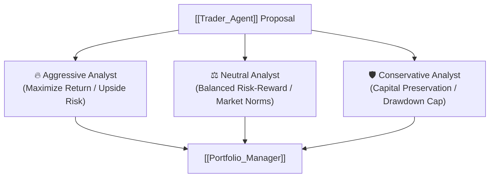

# 🛡️ Risk Management Team

> [!info] **Agent Overview**
> The **Risk Management Team** conducts a multi-faceted risk assessment on the order proposed by the [[Trader_Agent]]. It comprises three distinct risk personas: **Aggressive**, **Neutral**, and **Conservative**, who debate to find the optimal risk-adjusted execution profile.

---

## 🎭 The Three Risk Personas

| Persona | Objective | Output File |
| :--- | :--- | :--- |
| **Aggressive Analyst** | Emphasizes capturing asymmetric upside, accepting higher volatility and looser stops | `4_risk/aggressive.md` |
| **Neutral Analyst** | Evaluates standard statistical risk/reward ratios, historical drawdowns, and market volatility | `4_risk/neutral.md` |
| **Conservative Analyst** | Prioritizes principal preservation, tight stop losses, tail-risk scenarios, and liquidity constraints | `4_risk/conservative.md` |

---

## 📁 File Storage & Output Path

- **Source Code**: `tradingagents/agents/risk_mgmt/`
- **Execution Outputs**: Saved under `4_risk/` directory (see [[File_Storage_Map]]).
- **Consuming Agents**: [[Portfolio_Manager]]
