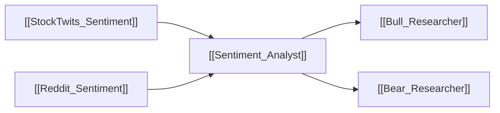

# 💬 Sentiment Analyst

> [!info] **Agent Overview**
> The **Sentiment Analyst** synthesizes social chatter, retail sentiment metrics, and community sentiment from StockTwits and Reddit to gauge short-term hype, fear, FOMO, and retail positioning.

---

## 🎯 Role & Objectives
- Aggregate message volume and sentiment scores from **StockTwits**.
- Scrape and analyze subreddit discussions (e.g. `r/wallstreetbets`, `r/stocks`, `r/investing`) from **Reddit**.
- Classify market perception into structured sentiment tiers (Strongly Bullish, Bullish, Neutral, Bearish, Strongly Bearish).
- Detect divergence between price momentum and retail hype.

---

## 🌐 Consumed Resources & Tools

| Resource | Purpose | Tool Function |
| :--- | :--- | :--- |
| [[StockTwits_Sentiment]] | Message volume, bullish vs bearish sentiment ratio | `get_stocktwits_sentiment()` |
| [[Reddit_Sentiment]] | Post discussions, comment volume, retail sentiment score | `get_reddit_sentiment()` |

---

## 📁 File Storage & Output Path

- **Source Code**: [`tradingagents/agents/analysts/sentiment_analyst.py`](file:///Users/ankit/Desktop/new%20lms%20trading/TradingAgents/tradingagents/agents/analysts/sentiment_analyst.py)
- **Execution Output**: Saved inside `1_analysts/sentiment.md` (see [[File_Storage_Map]]).
- **Consuming Agents**: [[Bull_Researcher]], [[Bear_Researcher]]

---

## 🔄 Upstream & Downstream Flow

