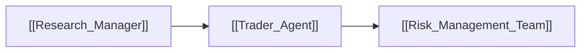

# 🎯 Trader Agent

> [!info] **Agent Overview**
> The **Trader Agent** transforms the Research Manager's investment thesis into an actionable trading order plan, complete with proposed actions (BUY / SELL / HOLD), entry price targets, stop losses, profit targets, and suggested position sizing.

---

## 🎯 Role & Objectives
- Translate macro/micro theses into executable trade proposals.
- Determine precise execution parameters:
  - Action: `BUY`, `SELL`, `HOLD`, `SHORT`, or `COVER`
  - Order Type: Market vs Limit
  - Stop Loss & Take Profit price thresholds
  - Time horizon (Short-term swing vs Long-term position)
- Submit the draft plan to the [[Risk_Management_Team]] for stress-testing.

---

## 📁 File Storage & Output Path

- **Source Code**: `tradingagents/agents/trader/trader.py`
- **Execution Output**: Saved in `3_trading/trader.md` (see [[File_Storage_Map]]).
- **Consuming Agents**: [[Risk_Management_Team]]

---

## 🔄 Upstream & Downstream Flow

