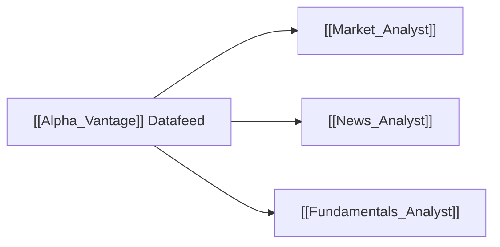

# ⚡ Alpha Vantage Dataflow

> [!abstract] **Data Provider Overview**
> **Alpha Vantage** delivers real-time and historical equity prices, calculated technical indicators (SMA, EMA, RSI, MACD, Bollinger Bands), company news sentiment, and quarterly earnings summaries.

---

## 🛠️ Modules & Capabilities

- **Technicals**: `tradingagents/dataflows/alpha_vantage_indicator.py`
  - Computes MACD, RSI, Stochastic, Moving Averages.
- **News**: `tradingagents/dataflows/alpha_vantage_news.py`
  - Streams categorized news and machine-learning sentiment scores per ticker.
- **Fundamentals**: `tradingagents/dataflows/alpha_vantage_fundamentals.py`
  - Financial statements, balance sheets, cash flows.

---

## 🤖 Consuming Agents

---

## ⚙️ Configuration & Caching
- **API Key**: Required via `ALPHA_VANTAGE_API_KEY` in `.env`.
- **Cache Location**: Raw responses are cached under `data_cache_dir` to prevent rate limiting (see [[File_Storage_Map]]).
