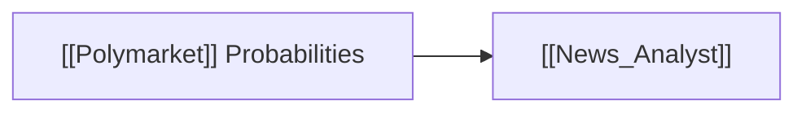

# 🔮 Polymarket Prediction Markets

> [!abstract] **Data Provider Overview**
> **Polymarket** provides real-money decentralized prediction market probabilities for political events, interest rate cuts/hikes, regulatory decisions, and major economic milestones.

---

## 🛠️ Capabilities & Logic
- Extracts real-time implied probability distributions for macroeconomic and sector events.
- Provides forward-looking event probabilities to augment backward-looking historical news.

---

## 🤖 Consuming Agents

