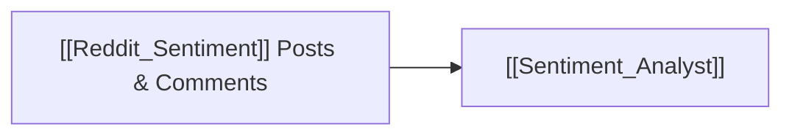

# 👾 Reddit Chatter & Sentiment Dataflow

> [!abstract] **Data Provider Overview**
> Ingests discussions, post velocity, and comment sentiment from top retail trading communities on Reddit (including `r/wallstreetbets`, `r/stocks`, `r/investing`, and `r/options`).

---

## 🛠️ Tracked Metrics
- Mention frequency & ticker buzz velocity.
- Retail hype vs panic ratio.
- Sentiment scoring across top-ranked submissions and comments.

---

## 🤖 Consuming Agents

