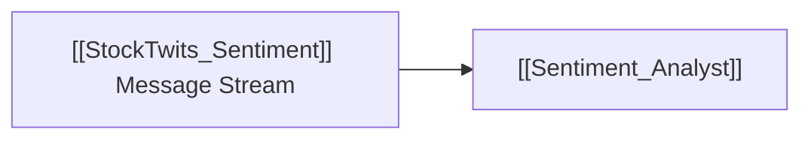

# 📱 StockTwits Sentiment Dataflow

> [!abstract] **Data Provider Overview**
> Real-time message streaming and retail trader sentiment polling directly from the StockTwits feed for any US equity or cryptocurrency ticker.

---

## 🛠️ Extracted Signals
- Explicit User Bullish vs Bearish tags.
- Message velocity per hour.
- Community sentiment trend change over 24h/7d windows.

---

## 🤖 Consuming Agents

