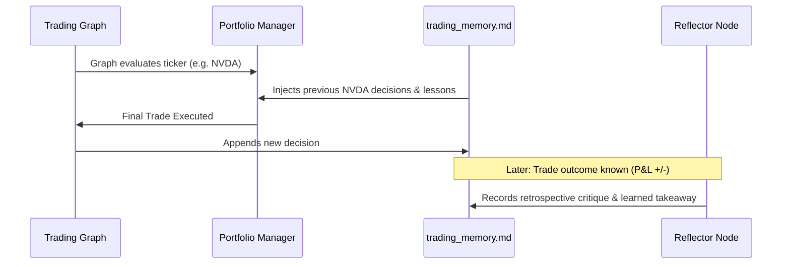

# 🧠 Trading Memory & Reflection Engine

> [!abstract] **Memory Engine Overview**
> The **Trading Memory Log** is a persistent markdown-based memory store that records trade rationales, outcomes, prediction errors, and self-reflections. When the system re-analyzes a company, the [[Portfolio_Manager]] injects relevant past lessons into its reasoning context.

---

## 🛠️ How Reflection Works

---

## 📁 File Location & Configuration
- **Default Path**: `~/.tradingagents/memory/trading_memory.md` (or configurable via `TRADINGAGENTS_MEMORY_LOG_PATH` in `.env`).
- **Pruning**: Configurable via `memory_log_max_entries` (see [[File_Storage_Map]]).
