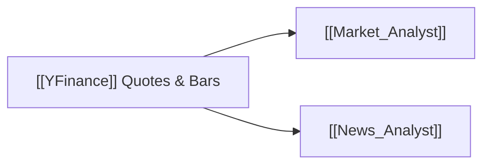

# 📊 YFinance Dataflow

> [!abstract] **Data Provider Overview**
> **YFinance** provides direct market quotes, historical daily/intraday OHLCV candlestick bars, volume data, and corporate news headlines without requiring an API key.

---

## 🛠️ Modules & Capabilities

- **Market Prices & Bars**: `tradingagents/dataflows/y_finance.py`
  - Fetches Open, High, Low, Close, Volume series across custom date ranges.
  - Multi-asset support: Equities, ETFs, Crypto pairs, and Commodities.
- **News Extraction**: `tradingagents/dataflows/yfinance_news.py`
  - Extracts breaking news articles and publisher metadata.

---

## 🤖 Consuming Agents

---

## ⚙️ Caching Strategy
- Price bars are cached locally in parquet/JSON format under `data_cache_dir` to accelerate backtests and multi-agent runs (see [[File_Storage_Map]]).
