# 🤖 MT5 Bot: Trend Pullback + Structure Break (M5 / M15)

> [!abstract] **Strategy Overview**
> This trading bot combines algorithmic **Market Structure Shift (BOS/CHoCH)** and **Dynamic EMA Pullback** logic on lower timeframes (M5) with higher-timeframe trend alignment (M15). Before firing any order to MetaTrader 5, each setup is validated by the **TradingAgents** multi-agent committee.

---

## 🏗️ Core Strategy Architecture

```mermaid
flowchart TD
    subgraph M15["📊 1. Higher Timeframe Filter (M15)"]
        EMA_ALIGN["20 EMA > 50 EMA > 200 EMA (Bullish)<br>20 EMA < 50 EMA < 200 EMA (Bearish)"]
        TREND_BIAS["Establish Macro Directional Bias"]
    end

    subgraph M5["📉 2. Lower Timeframe Execution (M5)"]
        SWING["Identify Confirmed Swing Highs & Lows (Fractals)"]
        BOS["Detect Break of Structure (BOS)"]
        PULLBACK["Detect Retracement to 20/50 EMA Value Zone (38.2% - 61.8% Fib)"]
        TRIGGER["Confirm Reversal Candle (Engulfing / Pinbar Rejection)"]
    end

    subgraph AGENTS["🤖 3. Multi-Agent Verification Committee"]
        MKT["[[Market_Analyst]] (Technicals & ATR)"]
        NEWS["[[News_Analyst]] (Macro News & Event Blackout)"]
        SENT["[[Sentiment_Analyst]] (Retail Crowd Mood)"]
        DEBATE["[[Bull_Researcher]] vs [[Bear_Researcher]] (Trap vs Breakout Debate)"]
        MGR["[[Research_Manager]] (Consensus Stance)"]
        RISK["[[Risk_Management_Team]] (Spread & Margin Check)"]
        PM["[[Portfolio_Manager]] (Authorization & [[Trading_Memory_Log]])"]
    end

    subgraph EXEC["⚡ 4. MT5 Execution & Position Management"]
        SIZING["Calculate Lot Size (1.0% Equity Risk / SL Distance)"]
        ORDER["Dispatch Market Order to MT5 Terminal"]
        MANAGEMENT["Shift to Break-Even at 1:1 R:R & Dynamic Trailing Stop"]
    end

    EMA_ALIGN --> TREND_BIAS
    TREND_BIAS --> SWING
    SWING --> BOS
    BOS --> PULLBACK
    PULLBACK --> TRIGGER
    TRIGGER --> AGENTS
    AGENTS --> EXEC
```



---

## 🤖 Detailed Multi-Agent Roles

| Agent / Persona | Bot Execution Role |
| :--- | :--- |
| **[[Market_Analyst]]** | Verifies M15 trend strength, M5 structure break confirmation, ATR volatility for stop-loss distance, and momentum divergence. |
| **[[News_Analyst]]** | Checks economic calendar & breaking macro news; flags blackout windows around major central bank / CPI announcements. |
| **[[Sentiment_Analyst]]** | Ingests StockTwits and Reddit sentiment to ensure the bot is not buying into a retail mass liquidation trap. |
| **[[Bull_Researcher]] & [[Bear_Researcher]]** | Debates whether the M5 pullback is an institutional liquidity refill or the beginning of a higher-timeframe reversal. |
| **[[Research_Manager]]** | Provides consensus conviction rating (`Buy` / `Sell` / `Hold`). |
| **[[Trader_Agent]]** | Formulates exact MT5 execution levels: Entry, Stop-Loss (Swing point + 1.5 ATR buffer), Take-Profit (1:2.5 R:R). |
| **[[Risk_Management_Team]]** | Validates spread limits, maximum slippage tolerance, account margin, and 4.0% daily drawdown circuit breaker. |
| **[[Portfolio_Manager]]** | Issues final execution authorization and writes reflection records to `trading_memory.md`. |

---

## 🛠️ Bot Parameters & Sizing Formulas

### 1. Dynamic Lot Sizing Formula
$$\text{Lot Size} = \frac{\text{Account Equity} \times \text{Risk \%}}{\text{Stop Loss Distance in Points} \times \text{Tick Value}}$$

- **Default Risk**: `1.0%` of floating account equity per position.
- **Stop Loss**: Placed below the confirmed M5 swing low (for Longs) or above the confirmed M5 swing high (for Shorts) with a **1.5 × ATR** volatility cushion.
- **Take Profit**: Default **1:2.5 Risk-to-Reward Ratio**.
- **Break-Even**: When the position reaches **1.0× Risk distance**, the Stop-Loss automatically moves to `Entry + 2 points`.

---

## 🚀 How to Run the Bot

### Option 1: Python MT5 Bot (Continuous Monitoring)
```bash
# Run continuous monitoring across target symbols
python3 -m mt5_bot.bot_runner

# Run single scan cycle on custom symbols
python3 -m mt5_bot.bot_runner --single --symbols "EURUSD,GBPUSD,XAUUSD,BTCUSD,NVDA" --risk 1.0
```

### Option 2: Native MQL5 Expert Advisor
1. Copy [`mt5_bot/TrendPullbackStructureBreak_EA.mq5`](file:///Users/ankit/Desktop/new%20lms%20trading/TradingAgents/mt5_bot/TrendPullbackStructureBreak_EA.mq5) to your MT5 `MQL5/Experts/` folder.
2. Open MetaEditor (F4) in MT5 and click **Compile** (F7).
3. Attach the EA to an **M5 chart** (e.g. `EURUSD` or `XAUUSD`) and enable **Algo Trading**.

---

## 📁 Related Knowledge Vault Links
- [[00_Dashboard|🏠 Command Center Dashboard]]
- [[File_Storage_Map|📁 Storage Architecture Map]]
- [[TradingAgents_Architecture.canvas|🎨 Interactive Visual System Canvas]]
- [[Trading_Memory_Log|🧠 Reflection & Memory Engine]]
