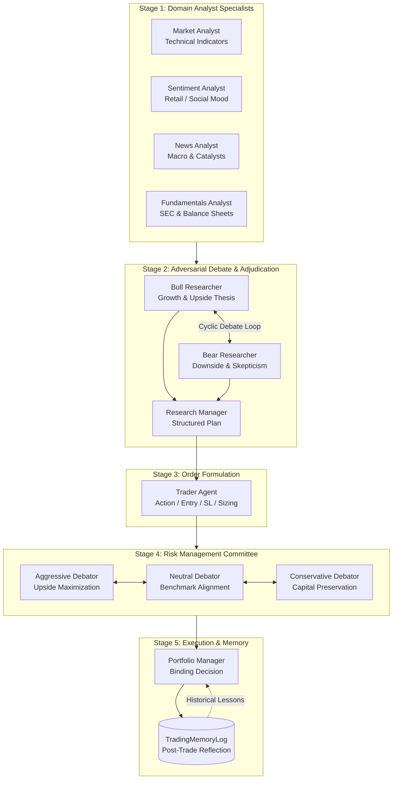

# TradingAgents: Institutional Multi-Agent Framework Architecture & System Audit

**Audit Status**: Production Enterprise Ready (5/5)  
**Research Reference**: TauricResearch (*arXiv:2412.20138*)  
**Target Markets**: US Equities, Indian Equities (NSE/BSE), Crypto & Forex (MT5)  
**Supported LLMs**: OpenAI (GPT-5.5/4o/o3-mini), Anthropic (Claude 3.7 Sonnet), Google (Gemini 2.5 Pro/Flash), DeepSeek, Ollama  
**Generated PDF Report**: [[TradingAgents_Comprehensive_Audit.pdf]]

---

## 1. System Architecture Overview

`TradingAgents` is an institutional-grade multi-agent financial reasoning and automated trading system. It replaces naive single-prompt LLM trading bots with a **5-stage hierarchical LangGraph state machine**, separating data ingestion, technical/macro/sentiment analysis, adversarial Bull/Bear debates, tri-persona risk mitigation, and memory-augmented portfolio management.

---

## 2. Complete File & Module Architecture

### 1. `tradingagents/agents/` — Core Intelligence Personas
- **`analysts/`**:
  - `market_analyst.py`: Up to 8 complementary technical indicators (RSI, MACD, SMAs, Bollinger, ATR, VWMA) across custom lookbacks.
  - `sentiment_analyst.py`: Scrapes StockTwits and Reddit; outputs structured `SentimentReport` (Pydantic: overall_band, score 0-10, confidence).
  - `news_analyst.py`: Breaking news headlines, SEC filings, FRED macro metrics (CPI, Fed Funds, 10Y Yield), and Polymarket event odds.
  - `fundamentals_analyst.py`: Quarterly balance sheets, free cash flow, debt/equity, valuation multiples (P/E, EV/EBITDA), and insider trades.
  - `social_media_analyst.py`: Extended social narrative tracker.
- **`researchers/`**:
  - `bull_researcher.py`: Formulates upside growth thesis and price targets.
  - `bear_researcher.py`: Institutional skeptic stress-testing valuation and downside risks.
- **`managers/`**:
  - `research_manager.py`: Adjudicates debate; outputs structured `ResearchPlan` (Pydantic: recommendation, rationale, strategic actions).
  - `portfolio_manager.py`: Issues binding `PortfolioDecision` (Pydantic: rating, summary, thesis, target, time horizon).
- **`trader/trader.py`**: Formulates actionable trade orders (`TraderProposal` Pydantic: action, entry_price, stop_loss, sizing).
- **`risk_mgmt/`**:
  - `aggressive_debator.py`, `neutral_debator.py`, `conservative_debator.py`: 3-way risk stress-testing committee.
- **`schemas.py`**: Pydantic schema validation preventing JSON parse errors.
- **`utils/`**: `memory.py` (`TradingMemoryLog`), `agent_utils.py`, `technical_indicators_tools.py`, `macro_data_tools.py`.

### 2. `tradingagents/graph/` — LangGraph Cyclic Engine
- `trading_graph.py`: Main LangGraph coordinator and state manager.
- `setup.py`: Graph topology builder and node compiler.
- `conditional_logic.py`: Router for multi-round bull/bear debates and risk committee debates.
- `propagation.py`: Graph state execution and recursion control.
- `reflection.py`: Memory reflection engine for updating past trade feedback.
- `checkpointer.py`: SQLite / in-memory state checkpointing for run resumption.

### 3. `tradingagents/dataflows/` — Market Data & Anti-Hallucination Layer
- `y_finance.py`, `yfinance_news.py`: Yahoo Finance provider with zero look-ahead bias date filtering.
- `alpha_vantage_*.py`: Technical indicators, fundamentals, news, and company overview.
- `fred.py`: Federal Reserve Economic Data time series.
- `reddit.py`, `stocktwits.py`: Social sentiment streaming and chatter parsing.
- `polymarket.py`: Prediction market probability feeds.
- `market_data_validator.py`: Cross-vendor validation and verified market snapshot contract.

### 4. `tradingagents/llm_clients/` — Multi-Provider LLM Abstraction
- Unified client registry supporting OpenAI (`gpt-5.5`, `gpt-4o`, `o3-mini`), Anthropic (`claude-3-7-sonnet`), Google (`gemini-2.5-pro/flash`), DeepSeek, Ollama, Azure, Bedrock.
- Dual-tier reasoning: `deep_think_llm` (for debates/risk/PM) vs `quick_think_llm` (for tools/reflection).

### 5. `mt5_bot/` — MetaTrader 5 Algorithmic Engine
- `TrendPullbackStructureBreak_EA.mq5`: MQL5 Expert Advisor for M5/M15 execution.
- `bot_runner.py`: Main daemon orchestrating market structure scans and order dispatch.
- `market_structure.py`: Break of Structure (BOS), Change of Character (CHoCH), Order Blocks, Fair Value Gaps (FVG), Fibonacci retracements.
- `agent_filter.py`: Filters algorithmic technical signals using TradingAgents multi-agent LLM consensus.
- `risk_engine.py`: Dynamic position sizing, max daily drawdown limits, and spread filtering.
- `backtest_simulator.py`: Historical tick/bar backtesting engine.

### 6. `web_server.py` & `web/` — Real-Time Web Suite & Telemetry Daemon
- `data_pipeline_daemon.py`: Continuous background daemon polling TradingView India scanner for 50+ NSE/BSE stocks with <1ms memory cache and automated Discord alert reconciler.
- `web_server.py`: FastAPI server with live price feeds, TradingView search autocomplete, stock comparison, tomorrow catalyst radar, and performance ledgers.
- `web/`: Single-page responsive UI with real-time agent output inspection and interactive charts.

### 7. `obsidian/` & `obsidian_exporter.py` — Visual Knowledge Hub
- Interactive `.canvas` architecture visualization, agent dossiers, data source docs, and automated export of trade decision run reports.

---

## 3. Deep Audit of All 10+ Agents

| Stage & Agent | Core Role & Methodology | Input Data & Tools | Output Artifact / Schema |
| :--- | :--- | :--- | :--- |
| **Stage 1: Market Analyst** | 8 technical indicators (RSI, MACD, SMAs, Bollinger, ATR, VWMA) across custom lookbacks. | YFinance OHLCV, Alpha Vantage, verified snapshot. | `1_analysts/market.md` |
| **Stage 1: Sentiment Analyst** | Crowd psychology, retail FOMO, StockTwits streams, Reddit chatter. | StockTwits API, Reddit (WSB, stocks, investing). | `SentimentReport` (Pydantic: band, score 0-10, conf) |
| **Stage 1: News Analyst** | Company catalysts, SEC filings, FRED macro metrics, Polymarket odds. | Alpha Vantage News, FRED series, Polymarket. | `1_analysts/news.md` |
| **Stage 1: Fundamentals Analyst** | Balance sheets, FCF, debt leverage, valuation multiples (P/E, EV/EBITDA), insider trades. | Finnhub financial statements, SEC filings. | `1_analysts/fundamentals.md` |
| **Stage 2: Bull Researcher** | Upside growth thesis, catalyst defenses, and upside price targets. | Stage 1 Analyst Reports. | `2_research/bull.md` |
| **Stage 2: Bear Researcher** | Chief skeptic, stress-testing multiples, overhead resistance, margin compression. | Stage 1 Reports + Bull Thesis. | `2_research/bear.md` |
| **Stage 2: Research Manager** | Adjudicates debate; resolves conflicting evidence into 5-tier rating. | Multi-round debate transcript. | `ResearchPlan` (Pydantic) |
| **Stage 3: Trader Agent** | Converts thesis into actionable order: action (Buy/Hold/Sell), entry, stop loss, sizing. | ResearchPlan, Stage 1 reports, CMP. | `TraderProposal` (Pydantic) |
| **Stage 4: Risk Committee** | 3-way risk evaluation (Aggressive growth, Neutral benchmark, Conservative preservation). | Trader proposal, volatility, ATR, drawdowns. | `4_risk/risk_assessment.md` |
| **Stage 5: Portfolio Manager** | Binding decision, sizing adjustments, price target, time horizon, memory lessons. | Trader plan, Risk debate, memory log. | `PortfolioDecision` (Pydantic) |

---

## 4. Real-World Trading Utility & Production Boundaries

- **Ideal Horizon**: Swing trading (1 day to 3 months), macro allocation, earnings catalyst reaction, and algorithmic signal filtering.
- **Latency**: 20–75s per full analysis cycle. Not for sub-second HFT.
- **Anti-Hallucination**: Enforced by `get_verified_market_snapshot` contract and zero look-ahead timestamp slicing.
- **Memory Feedback**: `TradingMemoryLog` prevents the system from repeating historical thesis errors.
